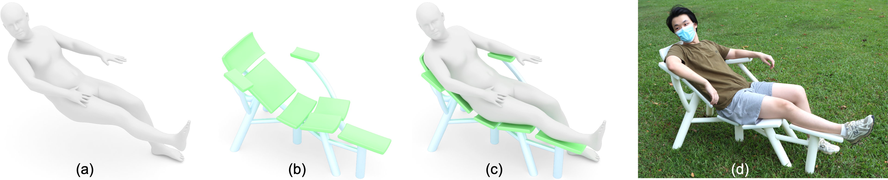
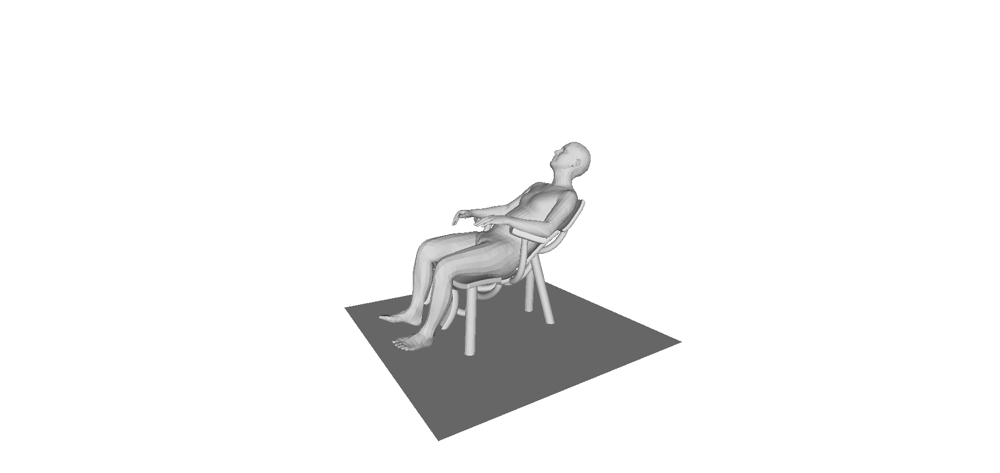
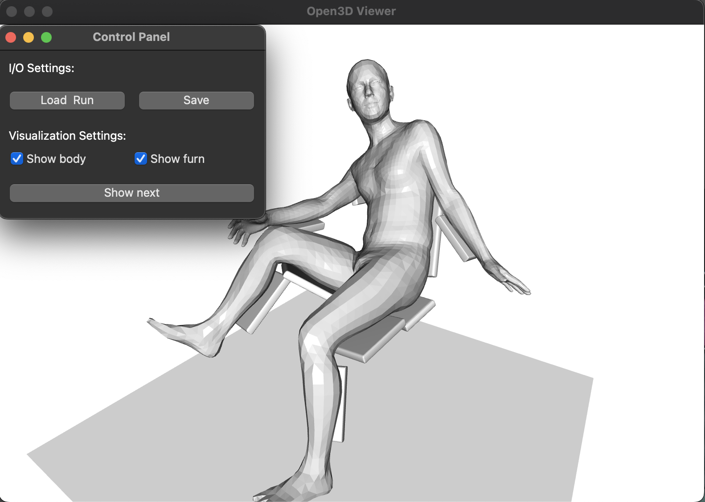

<p align="center">
 
</p>

<h3 align="center">Computational Design of Body-Supporting Assemblies</h3>

<div align="center">

  []() 
  [](/LICENSE)

</div>

This repo is the implementation of [Computational Design of Body-Supporting Assemblies](doc/papper.pdf). Commercial licensing is available upon request. If you have any problems when using this code,  you can contact me any time through yixuan_he@mymail.sutd.edu.sg.

If you make use of this repo in your scientific work, please cite our paper. For your convenience,
you can use the following bibtex snippet:

    @article {He-2025-Body2Assembly,
    author   = {Yixuan He and Rulin Chen and Bailin Deng and and Peng Song},
    title    = {Computational Design of Body-Supporting Assemblies},
    journal  = {Computer Graphics Forum (Pacific Graphics)},
    volume   = {44},
    number   = {7},
    year     = {2025}}

## Getting Started
The code has been tested on macOS (M3). It primarily depends on the **`NumPy`** library, with only a few additional dependencies, making it easy to run on other platforms.


### Prerequisites 

1.  Download SMPL Models (v1.1.0 for python) at https://smpl.is.tue.mpg.de/. Rename the pkl files and copy to folder `data/smpl`. The resulting folder is like:

```
data
└── smpl
   ├── SMPL_FEMALE.pkl
   ├── SMPL_MALE.pkl
   └── SMPL_NEUTRAL.pkl
```
2. Create a conda environment and install the dependencies. You may see a warning about incompatibility between **`bezier`** and **`NumPy`** 1.23.5, but this does not affect the functionality of the code.
```
conda create --name b2a python=3.8
pip install -r ./env.txt
pip install numpy==1.23.5
```

3. Prepare body input. We have provided three test cases in the `data/input` directory. For additional examples, you can refer to the interactive demo [body-model-visualizer](https://github.com/mkocabas/body-model-visualizer).
(Note: conversion to .pkl or .txt format is required; see the provided test cases for reference)

### Running the Code


1. Running with CLI. Activate the enviroment and run the code. Configuration files is in `configs`. The results are saved in `data/results` and can be viewed with any graphics viewer.

```
conda activate b2a
python main.py
```
<p align="center">
 
</p>

2. Alternatively, you can run the code over gui, to inspect the intermediate results of optimization.
<p align="center">
 
</p>

## Authors
- [Yixuan He](https://github.com/abcqmars) 
- [Rulin Chen](https://github.com/Linsanity81) 
- [Bailin Deng](https://github.com/bldeng)
- [Peng Song](https://songpenghit.github.io/)

## Acknowledgements
We thank the reviewers for their valuable comments, Haoyu Tang for participating in the user study, Pengyun Qiu and Yuhang Wang for preliminary work when the project started. This work was supported by the Singapore MOE AcRF Tier 2 Grants (MOE-T2EP20222-0008, MOE-T2EP20123-0016).


